# DISCORD BOT SAMPLE #
This is a sample Discord bot app. You can add a bot to your Discord server and use `!msg` or `!m` to send commands to the Bot. The bot will reply with a meme or a joke.
## Prerequisite ##
- Python 3.x: 
    https://www.python.org/downloads/
- Discord Account and a Discord Server to which you have admin permissions.
## Create Discord Bot Application ##
1. Log in to Discord Developer Portal
    https://discord.com/developers/applications
2. Click `New Application` to create a new Discord Application.

    [](images/image1.png)
3. In the `CREATE AN APPLICATION` window, enter your Discord Application Name and accept to agree to Discord T&C, then click `Create` to create a Discord Application.

    [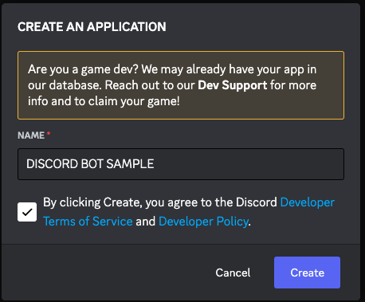](images/image2.png)
4. After your Discord Application is created, click on `Bot` from the `SETTINGS` menu.

    [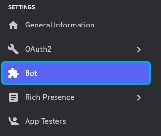](images/image3.png)
5. Set a `USERNAME` for your Discord Bot.

    [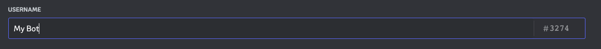](images/image4.png)
6. Under USERNAME, click `Reset Token` to generate Bot Token.

    [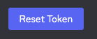](images/image5.png)
7. Click `Yes, do it!` to generate a new Bot Token.

    [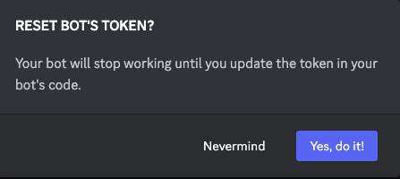](images/image6.png)
8. Click `Copy` to copy your Bot Token. (Bot Token in the image below is a sample). Keep this Bot Token safe. You will use this token in your `config.json` file.

    [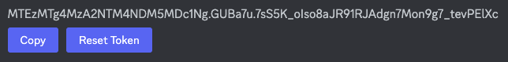](images/image7.png)
9. Under `Privileged Gateway Intents`, turn on `MESSAGE CONTENT INTENT`.

    [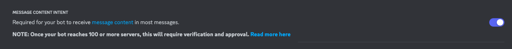](images/image8.png)
10. Save Bot settings by clicking `Save Changes`.

    [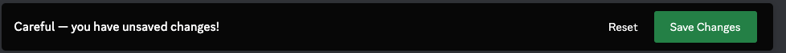](images/image9.png)
11. Click on `OAuth2` &rarr; `URL Generator` from the `SETTINGS` menu.

    [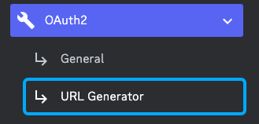](images/image10.png)
12. Select `Bot` under `Scope`.

    [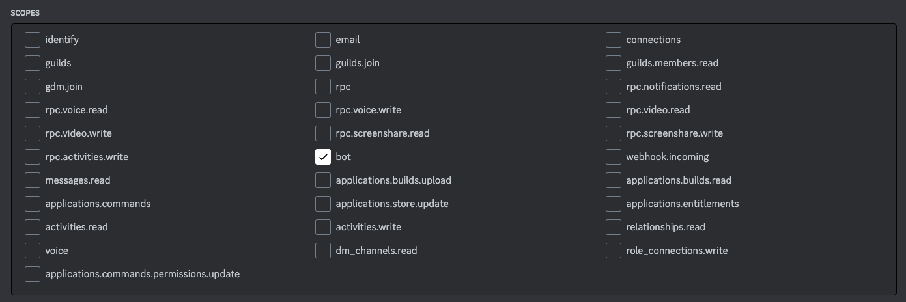](images/image11.png)
13. Select `Read Messages/View Channels` in the `GENERAL PERMISSIONS` section and `Send Messagers`, `Embed Link` in the `TEXT PERMISSIONS` section under `BOT PERMISSIONS`

    [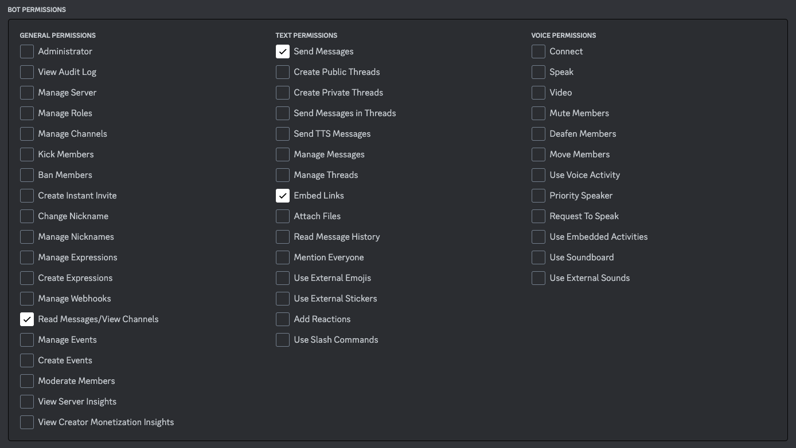](images/image12.png)
14. Copy the `GENERATED URL` by clicking `Copy`

    [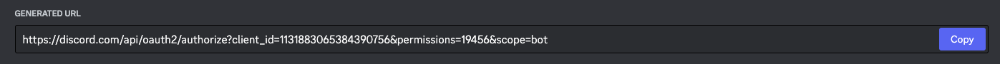](images/image13.png)
15. Open a new browser tab and paste Generated URL.
16. Select a Discord Server to which you have admin permissions. Then Click `Continue`.

    [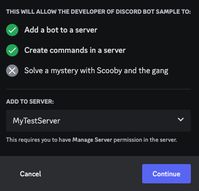](images/image14.png)
17. Make Sure `Read Messages`, `Send Messages` and `Embed Links` are selected and then click `Authorise`

    [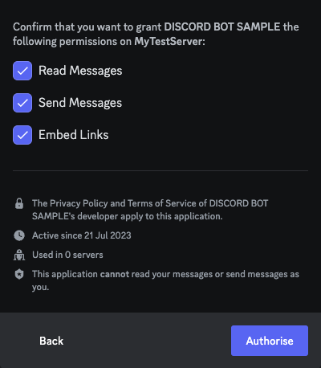](images/image15.png)
18. Congratulation! You added your Discord Bot to your Discord Server.

    [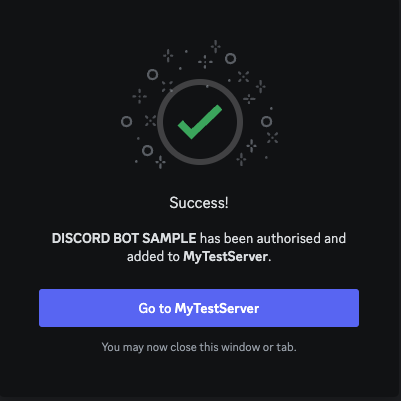](images/image16.png)

    [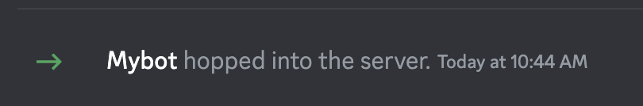](images/image17.png)
## Installation ##
1. Clone the repository: 
    ```{python}
    git clone https://github.com/daisuketanabe/discord-bot-sample.git
    ```
2. Navigate to the project directory:
    ```{python} 
    cd discord-bot-sample
    ```
3. Create a virtual environment: 
    ```{python}
    python -m venv .venv
    ```
    or

    ```{python}
    python3 -m venv .venv
    ```
4. Activate the virtual environment:
 * Windows: 
    ```{python}
    .venv\Scripts\activate.bat
    ```
 * Unix/Mac: 
    ```{python} 
    source .venv/bin/activate
    ```
5. Install dependencies: 
    ```{python}
    pip install -r requrements.txt
    ```
8. Copy `sample_config.json` file as `config.json`.
9. Update the configuration in `config.json` with your Discord Bot Token
## Usage ##
1. Activate the virtual environment:
- Windows: env\Scripts\activate.bat
- Unix/Mac: source env/bin/activate
2. Run the Discord Bot app: 
    ```{python}
    python main.py
    ```
    or
    ```{python}
    python3 main.py
    ```
3. Use `!msg` or `!m` in the discord channel to send command.

    [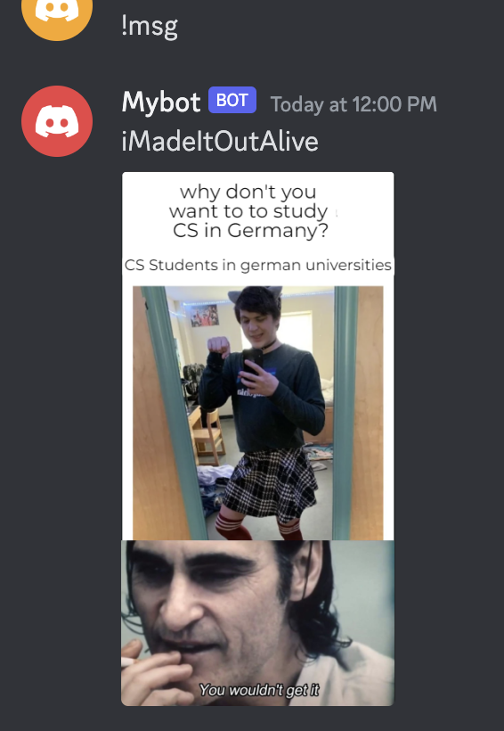](images/image18.png)
## Project Structure ##
* main.py: Main bot application file.
* reddit_api.py: Reddit API module.
* chucknorris_api.py: Chucknorris API module.
* config.json: Configuration file for the app
* sample_config.json: Sample config.json file
* README.md: This file.
## Contribution ##
If you would like to contribute to this project, please follow these steps:
1. Fork the repository.
2. Create a new branch: git checkout -b my-new-feature
3. Make your changes and commit them: git commit -am 'Add some feature'
4. Push to the branch: git push origin my-new-feature
5. Submit a pull request.
## License ##
This project is licensed under the MIT License. 
